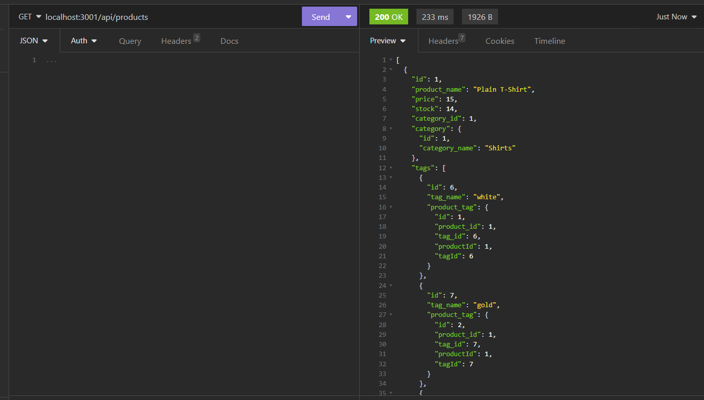

# E-Commerce-Backend

## Description
    
The E-Commerce-Backend is a backend setup for a retail inventory database. It is seeded by MySQL with products and their corresponding tags and product categories. We are able to query this inventory based on user requests to see products based on category, tags or search based on primary keys. The user is able to create new products, tags, categories and do other actions as well as our other HTTP request types (GET, POST, PUT, DELETE). The products, tags and categories are defined in their respective models

    
## Table of Contents (Optional)
    
- [Installation](#installation)
- [Usage](#usage)
- [Credits](#credits)
- [Contribute](#contribute)
- [Questions](#questions)

    
## Installation
    
This application runs locally using NodeJS, it is not deployed anywhere so the user will need to run the application from their command line using Node
    
## Usage
    
The user uses a local API testing application such as Insomnia or Postman to hit the various routes to query for different data from the DB
    

        
    
## Credits
    
Just Bootcamp course materials

## Contribute
    
If you created an application or package and would like other developers to contribute it, you can include guidelines for how to do so. The [Contributor Covenant](https://www.contributor-covenant.org/) is an industry standard, but you can always write your own if you'd prefer.
    
## Tests
    
just local testing

## Questions

If you have any questions, feel free to reach out to me at nate.mcmahon47@gmail.com or reference my GitHub:
[github.com/natemcmahon](github.com/natemcmahon)